# Superagents

Phase-gated, resumable, multi-agent development orchestration:

> **REFINE → PLAN → DEVELOP → TEST → AUTOTEST** (autotest optional)

in **three coexisting variants** that share the same on-disk state, templates, and rules — so a task refined in one variant can be planned in another, and any phase can resume in a fresh session days later.

| Variant | Run inside | Orchestration & validation | Coding & exploration | Claude tokens |
|---|---|---|---|---|
| **HYBRID** (`/sa:*`) | Claude Code | Claude (opus) | opencode (your model) | high |
| **REV** (`/rev-*`) | opencode | opencode orchestrates; Claude (`claude -p`) writes specs/plans + validates | opencode | medium |
| **FULL-OC** (`/oc-*`) | opencode | opencode | opencode | zero |

Installation: see **[INSTALL.md](INSTALL.md)** (script + manual + validation script).

---

## 1. The big picture

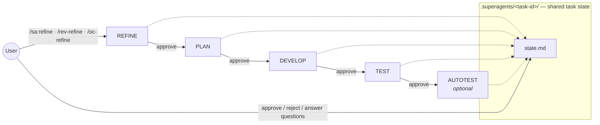

Every phase:

1. starts only when the previous phase is **approved** (gate),
2. produces validated artifacts under `.superagents/<task-id>/`,
3. ends **awaiting-approval** with a ≤10-line summary for the user,
4. can be resumed after a crash or new session — `state.md` is the single source of truth.

### Phase state machine (per phase, per task)

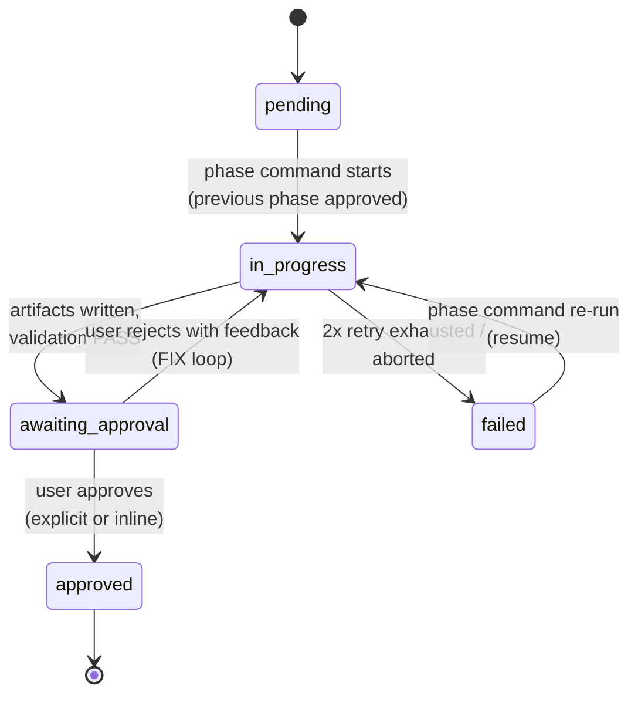

### The validation feedback loop (every gate, every phase)

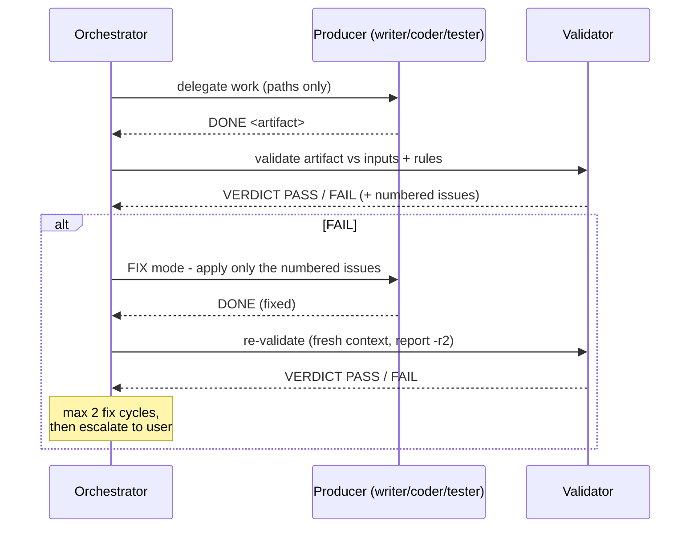

Key properties, all enforced (not just instructed):

- **Technology-agnostic** — projects and test waves are discovered from exploration and the rules manifest, never assumed.
- **Token-optimized** — path-based handoffs, exploration redirected to files, fresh context per project/wave, manifest-matched rules only.
- **Hallucination-guarded** — evidence citations required, validators flag unbacked claims, narrow per-agent permissions, verify-then-trust file checks after every delegation.
- **Truthful state** — `opencode run` exits 0 even when a session dies; `state.md` is the only truth. A phase still `in-progress` means "resume me".

---

## 2. Who does what — agents per variant

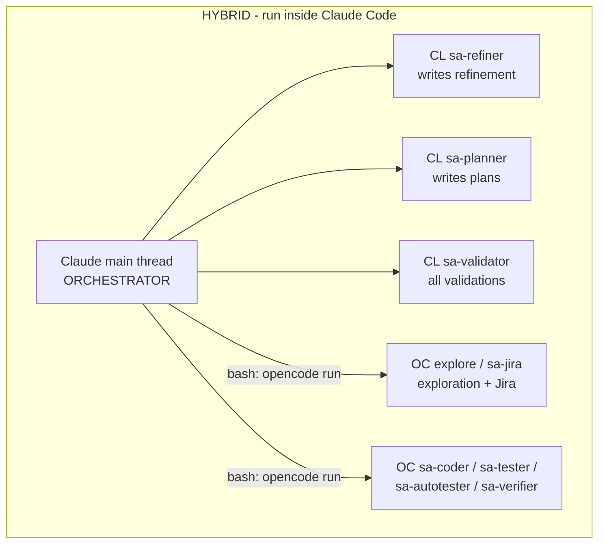

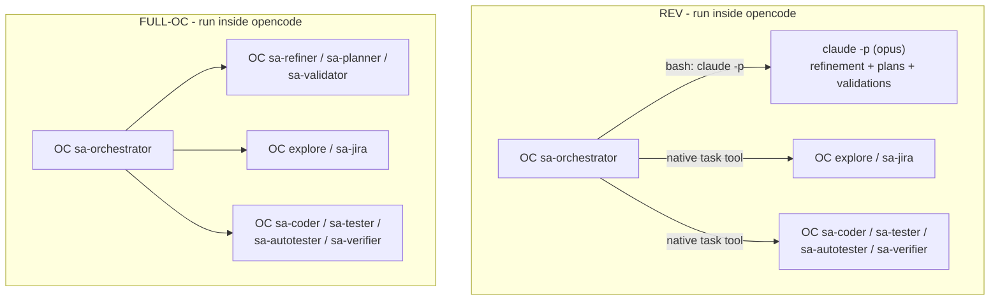

The full delegation table (the authoritative one lives in the `sa-workflow` skill):

| Work | HYBRID | REV | FULL-OC |
|---|---|---|---|
| Orchestration | Claude main thread | OC `sa-orchestrator` | OC `sa-orchestrator` |
| Jira fetch | OC `sa-jira` via bash | OC `sa-jira` | OC `sa-jira` |
| Code exploration | OC `explore` via bash | OC `explore` | OC `explore` |
| Write refinement | CL `sa-refiner` | `claude -p` | OC `sa-refiner` |
| Write plans (incl. autotest plan) | CL `sa-planner` | `claude -p` | OC `sa-planner` |
| Implement code | OC `sa-coder` via bash | OC `sa-coder` | OC `sa-coder` |
| Implement tests | OC `sa-tester` via bash | OC `sa-tester` | OC `sa-tester` |
| Implement automation tests | OC `sa-autotester` via bash | OC `sa-autotester` | OC `sa-autotester` |
| Run builds/tests | OC `sa-verifier` via bash | OC `sa-verifier` | OC `sa-verifier` |
| Validate artifacts | CL `sa-validator` | `claude -p` (read-only role) | OC `sa-validator` |

---

## 3. Phase-by-phase detail

### REFINE — from prompt (± Jira) to a validated spec

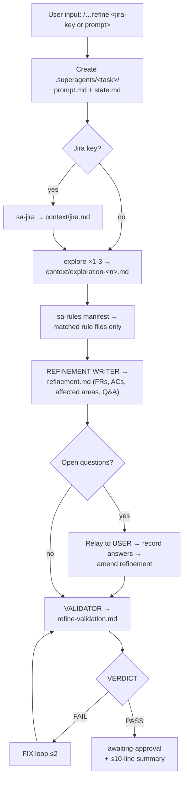

*Writer:* CL sa-refiner / `claude -p` / OC sa-refiner. *Validator:* CL sa-validator / `claude -p` / OC sa-validator (per variant, same for all phases below).

### PLAN — one plan per project + a high-level plan

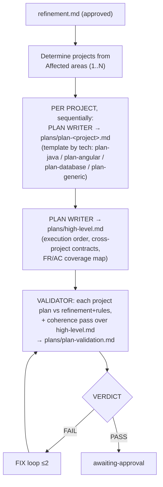

### DEVELOP — implement per project, in plan order

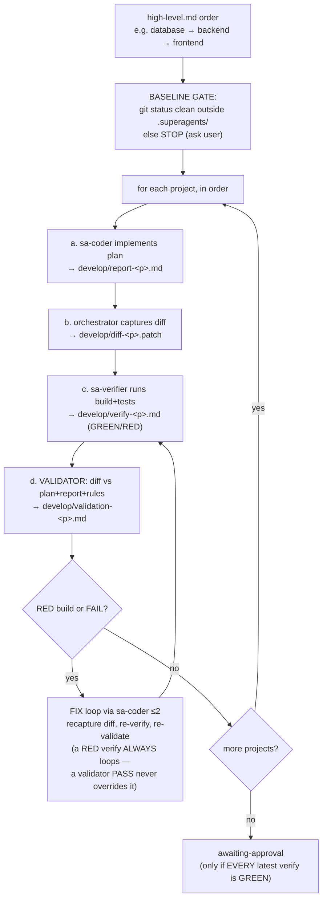

### TEST — waves from the rules manifest, with visible verdicts

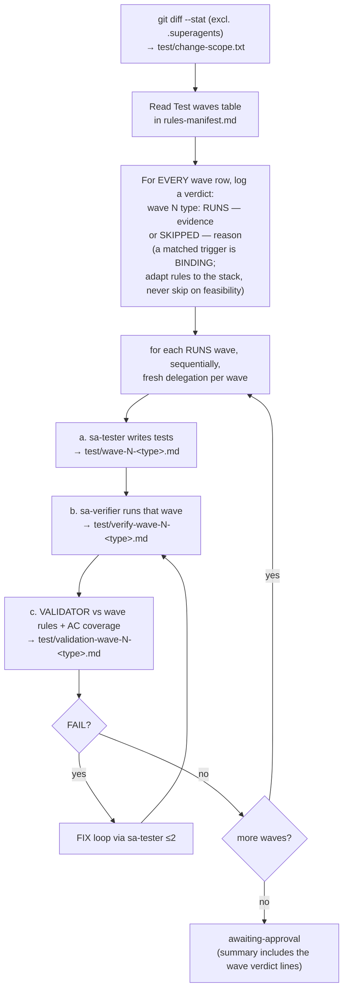

### AUTOTEST — optional end-to-end automation (e.g. Playwright)

Enabled purely by an `automation`-tagged rules file in the manifest. Self-contained: runnable in a totally fresh session (its plan embeds a delivered-work handoff).

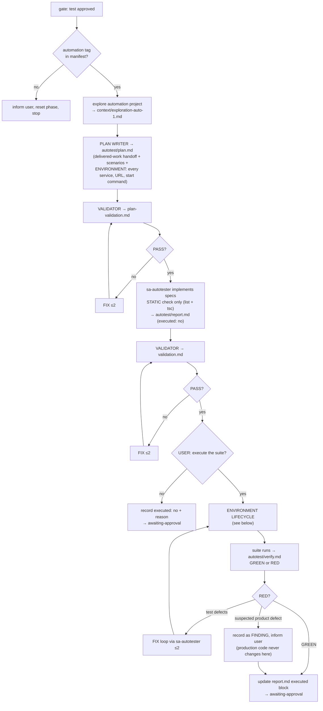

**Environment lifecycle (rule 14 — works for any number of services):** the autotest plan's environment section enumerates *every* service with its base URL and local start command.

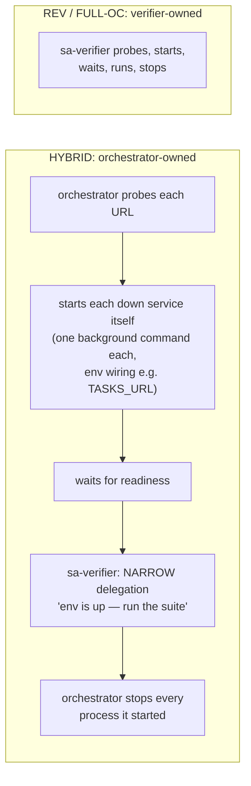

Unreachable **and** not locally runnable → the phase asks the user / reports BLOCKED — never a RED "failure".

---

## 4. Repository layout (source tree)

```
superagents/
├── claude/                         → installs into ~/.claude/
│   ├── agents/                     Claude subagents (HYBRID writers/validator)
│   │   ├── sa-refiner.md
│   │   ├── sa-planner.md
│   │   └── sa-validator.md
│   ├── commands/sa/                /sa:* commands (HYBRID)
│   │   ├── refine.md  plan.md  develop.md  test.md  autotest.md
│   │   ├── approve.md              approve any variant's task
│   │   └── status.md               list tasks + phase states
│   └── skills/                     the three SHARED skills (opencode reads them too)
│       ├── sa-workflow/SKILL.md    state machine, delegation tables, contracts
│       ├── sa-templates/           SKILL.md + templates/ (11 artifact templates)
│       └── sa-rules/               SKILL.md + rules/ (rules-manifest.md + rule files)
├── opencode/                       → installs into ~/.config/opencode/
│   ├── agents/                     9 opencode agents
│   │   ├── sa-orchestrator.md      primary agent driving /oc-* and /rev-*
│   │   ├── sa-refiner.md  sa-planner.md  sa-validator.md   (FULL-OC writers)
│   │   ├── sa-coder.md  sa-tester.md  sa-autotester.md     (workers)
│   │   ├── sa-verifier.md          runs builds/tests, reports facts
│   │   └── sa-jira.md              the only agent with Jira MCP access
│   ├── commands/                   12 commands
│   │   ├── oc-refine.md  oc-plan.md  oc-develop.md  oc-test.md  oc-autotest.md
│   │   ├── oc-approve.md  oc-status.md               (serve ALL variants' tasks)
│   │   └── rev-refine.md  rev-plan.md  rev-develop.md  rev-test.md  rev-autotest.md
│   └── opencode.jsonc              model + Jira MCP + permission config (placeholders)
├── install.sh                      one-shot global installer
├── validate-install.sh             post-install readiness check (see INSTALL.md)
├── INSTALL.md                      installation, validation, troubleshooting
└── README.md                       this file
```

Per-task state (created in **your target repository**, all variants share it):

```
.superagents/<task-id>/
├── state.md                      phase state machine + log (the single source of truth)
├── context/                      prompt.md, jira.md, exploration-<n>.md
├── refinement.md                 + refine-validation.md
├── plans/                        plan-<project>.md ×N, high-level.md, plan-validation*.md
├── develop/                      report/diff/verify/validation per project (+ -r2 revisions)
├── test/                         change-scope.txt, wave/verify/validation per wave
└── autotest/                     plan.md, report.md, verify.md, validations
```

Recommended: add `.superagents/` to the target repo's `.gitignore`, and **commit between tasks** (DEVELOP has a hard gate against dirty baselines).

---

## 5. Agents, skills, commands — reference

### Claude-side agents (HYBRID)

| Agent | Model | Role | Writes |
|---|---|---|---|
| `sa-refiner` | opus | Turns prompt + Jira + exploration into a validated refinement; raises open questions instead of guessing | `refinement.md` only |
| `sa-planner` | opus | One plan per invocation (project plan, high-level, or autotest plan) | `plans/*`, `autotest/plan.md` |
| `sa-validator` | opus | Validates ONE artifact vs its inputs + rules; PASS/FAIL + numbered issues; read-only otherwise | its report file only |

None of them ever read application source — only `.superagents/` artifacts, templates, and rules.

### opencode agents

| Agent | Mode | Role | Guardrails |
|---|---|---|---|
| `sa-orchestrator` | primary | Drives `/oc-*` and `/rev-*` phases per the sa-workflow skill | bash allowlist + `"*": ask`; edits only `.superagents/**`; single simple commands only |
| `sa-refiner` / `sa-planner` / `sa-validator` | subagent | FULL-OC writers/validator | no bash/web; edit only `.superagents/**` |
| `sa-coder` | all | Implements ONE project plan + dev report | no web; broad read/edit/bash (it writes code) |
| `sa-tester` | all | Implements ONE test wave + wave report | same tier as coder |
| `sa-autotester` | all | Implements automation specs (static check only) | same tier as coder |
| `sa-verifier` | all | Runs exactly the commands given; facts only; `RESULT: GREEN/RED` | never edits source; report file only |
| `sa-jira` | all | Fetches Jira issues via MCP | the only agent with `jira*` tools enabled |

`mode: all` workers can be selected directly with `opencode run --agent <name>`; `mode: subagent` agents (incl. built-in `explore`) must be invoked with the mention form `opencode run "@explore …"` — `--agent` silently falls back to the default agent for those.

### Shared skills (installed once under `~/.claude/skills/`, read by both tools)

| Skill | Contents | Used by |
|---|---|---|
| `sa-workflow` | The state machine, delegation tables, output/validation contracts, phase procedures. **Loaded FIRST by every phase command.** | all orchestrators |
| `sa-templates` | 11 artifact templates (state, refinement, plan-java/angular/database/generic/high-level/autotest, dev-report, test-wave-report, autotest-report) — new `plan-<type>.md` files are picked up automatically | all writers |
| `sa-rules` | `rules-manifest.md` (tags → rule files; Test waves table; automation enablement) + starter rule files. Agents load ONLY manifest-matched files | writers + validators + TEST wave selection |

The shipped rule files are **starter examples** — replace them with your organization's real rules; the manifest is the single registration point.

### Commands

| Purpose | HYBRID (Claude Code) | REV (opencode) | FULL-OC (opencode) |
|---|---|---|---|
| Refinement | `/sa:refine <input>` | `/rev-refine <input>` | `/oc-refine <input>` |
| Plan | `/sa:plan [task]` | `/rev-plan [task]` | `/oc-plan [task]` |
| Develop | `/sa:develop [task]` | `/rev-develop [task]` | `/oc-develop [task]` |
| Test | `/sa:test [task]` | `/rev-test [task]` | `/oc-test [task]` |
| Autotest (optional) | `/sa:autotest [task]` | `/rev-autotest [task]` | `/oc-autotest [task]` |
| Approve (any variant's task) | `/sa:approve [task]` | `/oc-approve [task]` | `/oc-approve [task]` |
| Status (any variant's task) | `/sa:status` | `/oc-status` | `/oc-status` |

`<input>` = a Jira key (`PROJ-123 …`), or a plain feature description (task-id becomes a kebab-case slug). `[task]` can be omitted when exactly one task is at the right gate.

---

## 6. A multi-project example (fictional)

*Scenario:* the **"shopfront"** repo contains three projects — `catalog-api/` (Java), `pricing-service/` (Java, calls catalog), and `web/` (frontend) — plus a Playwright `e2e/`. You want:

> "Add a `discountPercent` to products. Catalog API validates it (0–90, default 0) and returns it; pricing-service applies it to computed prices; the web product page shows the discounted price with a badge."

**REFINE** — `/sa:refine Add discountPercent to products …`
The workflow explores the repo (1–3 focused questions → `context/exploration-*.md`), matches the `java` + `controller`/`service` rule files, and the refiner writes `refinement.md`: 10 FRs with Given/When/Then ACs, an affected-areas table naming *all three* projects with file evidence, and — because you didn't specify it — an open question: *"absent `discountPercent` on existing products: treat as 0 or migrate?"* You answer; the Q&A is recorded; validation PASS → approve.

**PLAN** — `/sa:plan`
Three project plans are written sequentially (`plan-catalog-api.md`, `plan-pricing-service.md`, `plan-web.md` — Java ones from the `plan-java` template, web from `plan-generic`), then `high-level.md` fixes the execution order **catalog-api → pricing-service → web** (pricing consumes the catalog contract; web consumes both) and pins the cross-project contract (field name, range, default, error body). The validator cross-checks every FR is owned by exactly one plan → approve.

**DEVELOP** — `/sa:develop`
Baseline gate first (`git status` must be clean). Then per project, in order: coder implements → orchestrator captures `diff-<project>.patch` → verifier runs that project's build/tests (`GREEN` required) → validator checks the diff against plan + rules. If pricing-service's existing tests break because the price JSON changed, that's a RED verify → automatic FIX loop (the coder updates the affected expectations; the suite must be green *in this phase*). Three green projects → approve.

**TEST** — `/sa:test`
Change scope is computed; every wave row in the manifest gets a logged verdict, e.g.
`wave 1 java-unit: RUNS — catalog + pricing production code` · `wave 2 java-repository: SKIPPED — no persistence infrastructure changed` · `wave 3 java-integration: RUNS — controllers/services + catalog→pricing cross-service flow`.
Waves run one at a time (tester → verifier → validator). The summary you approve shows the verdicts *and* the results — a wrong skip is visible before you approve it.

**AUTOTEST** — `/sa:autotest` *(optional)*
The autotest plan opens with the delivered-work handoff, lists API + UI scenarios with exact spec paths, and its environment section enumerates **all three services** — catalog-api :8081, pricing-service :8082 (`CATALOG_URL=http://localhost:8081`), web :8083 — each with start command and readiness URL. After the specs are implemented (static check) and validated, you're asked whether to execute. In HYBRID the orchestrator starts the three services itself, hands the verifier only "run `npx playwright test`", and stops them afterwards; in REV/FULL-OC the verifier owns that lifecycle. GREEN run → the report's `executed:` block is updated → approve, commit, done.

Total artifacts: one `.superagents/add-discount-percent/` tree with every decision, diff, verdict, and run result — auditable and resumable at any point.

---

## 7. Operational notes (learned from live multi-run testing)

- **Interactive-first**: phases ask the user real questions (open requirements, artifact conflicts, execute-or-not). In the TUI they land as prompts; headless they end the run cleanly with the question in the output — answer by re-running the phase command with your answer.
- **Headless driving** works for `/oc-*`/`/rev-*` with three hard rules (see INSTALL.md §Headless): always `--command`, expect `ask`-permissions to auto-reject, and trust only `state.md` afterwards.
- The fix loops converge: across our test campaign every validator FAIL was either a genuine defect caught (plan gaps, selector-policy violations, hardcoded URLs, broken existing suites, a real spec ambiguity found by e2e) or a correctly escalated user decision — each resolved within the 2-cycle cap.
- **Model backends can stall.** Long-running worker calls should be supervised (kill + re-run the phase; state resumes). `claude -p` usage limits pause REV phases cleanly — resume after reset.

## 8. Related docs

- **[INSTALL.md](INSTALL.md)** — prerequisites, automatic + manual install, file inventory, model configuration, `validate-install.sh`, headless rules, permission model, troubleshooting, uninstall.
